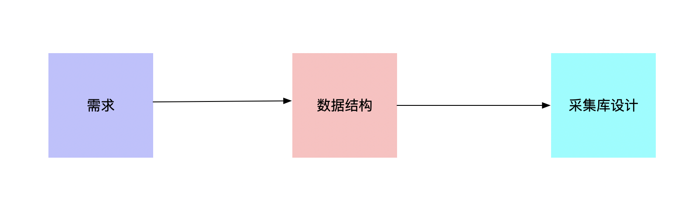
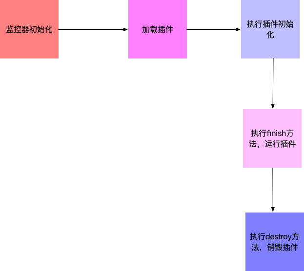

# monitorjs

端内监控api，收集用户端的数据，然后上报给服务接口

### 设计思路


### 需求
1. 首次绘制时间
2. 首次有效绘制
3. dom加载完成时间
4. 资源加载完成事件
5. 各个类型资源加载事件统计

### 数据结构
``` ts
interface ICommon {
  documentURL: string; // 指纹
  userAgent: string; // 指纹
  userId: string; // 指纹
}

interface IPaint {
  type: string;
  name: string;
  time: string;
  common: ICommon;
}

interface IAsset {
  url: string;
  time: string;
  assetType: string;
  size: number;
  common: ICommon;
}

```

### 用户端监控Api设计


### 插件系统
```ts
abstract class Plugin {
  private monitor: Monitor
  visit(monitor: Monitor): void;
  run(): void;
  destroy(): void;
}

abstract class Monitor {
  data: any;
  plugins: Plugin[];
  visit(plugin: Plugin): void;
  addPlugin(plugin: Plugin): void;
  addData(data: any): void;
  run(): void;
  destroy(): void;
}
```